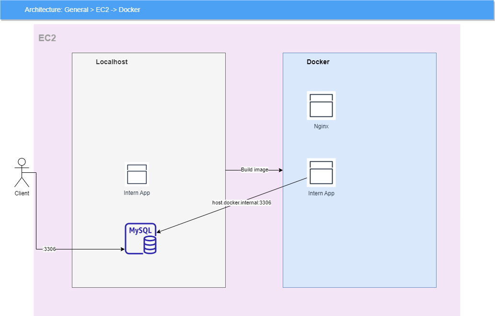

# Webnode-JS-Intern
- Using Terraform to init infrastructure (AWS)
- Nodejs v18
- Docker v20.
- Nginx

# Deploy command (docker compose)
## 🚀 Getting Started
Follow these steps to set up and run the project on your local machine.

### 1. Clone the Repository

First, clone this repository to your local machine and navigate into the project directory:

```bash
git clone https://github.com/bwv-phuc-cvh/bwv-intern.git
```

### 2. Install Dependencies

Open a terminal in the project's root directory and run the following command to install all the required packages from package.json:

```bash
npm i
```

### 3. Configure Environment Variables

The project uses environment variables for configuration, such as database credentials and application settings.

#### 3.1. In the root directory of the project, create a new folder named env

```bash
mkdir env
```

#### 3.2. Inside the env folder, create a new file named local.env.

#### 3.3. Copy the content below into your local.env file and replace the placeholder values with your actual configuration

```bash
# The port the application will run on
PORT=3000

# TypeORM connection configuration
TYPEORM_HOST=db_host
TYPEORM_USERNAME=your_name
TYPEORM_PASSWORD=your_password
TYPEORM_DATABASE=your_database
TYPEORM_PORT=your_port

# Other database configurations (if needed)
DB_PASSWORD=db_password
DB_NAME=db_name
```
### 4. Build the Source Code

Run the following command to compile the project's source code (e.g., from TypeScript to JavaScript)

```bash
npm run build
```

### 5. Run with Docker Compose

Finally, use the command below to build the Docker images and start the containers. This command will use the local.env file you created to safely pass environment variables to the containers.

```bash
docker-compose --env-file ./env/local.env up -d --build
```

Parameter Explanation:

* `--env-file ./env/local.env`: Specifies the environment file to use.

* `up`: Creates and starts the containers.
* `-d`: Runs the containers in the background.
* `--build`: Forces Docker Compose to rebuild the images before starting the containers, ensuring the latest code changes are applied.

# Source code intern design

# deploy-project
# phuc.cvh-bwv